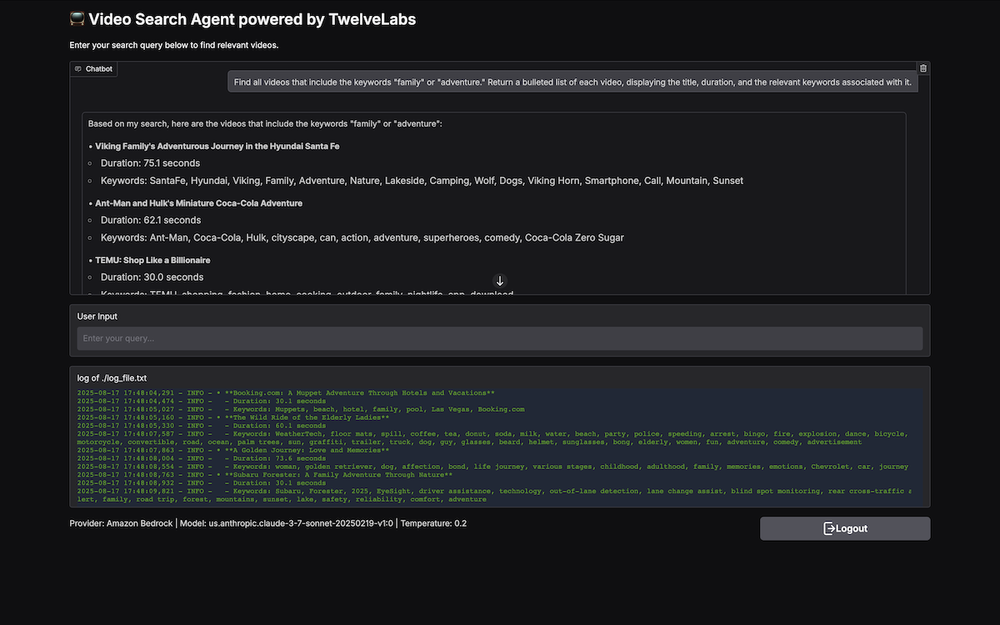
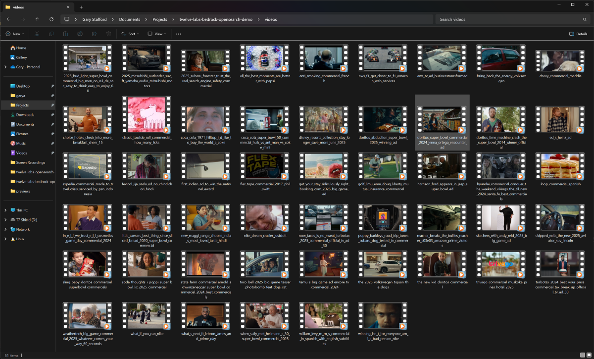
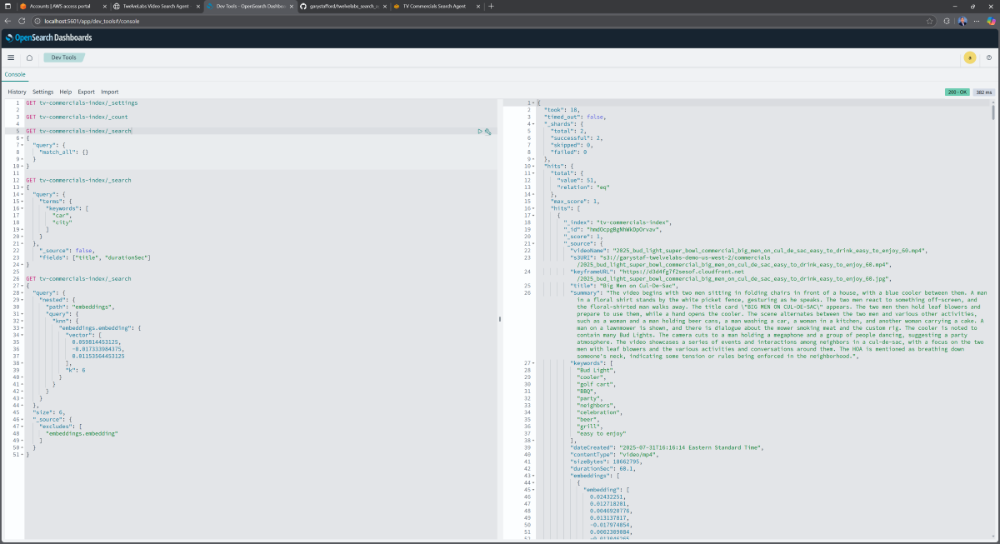
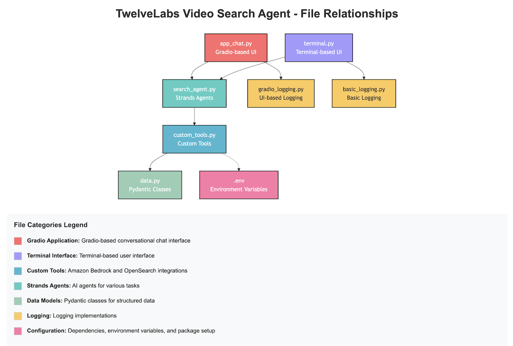

# TwelveLabs Video Search Agent

Demonstration of a Video Search Agent build with [AWS Strands Agents](https://strandsagents.com/latest/), [TwelveLabs on Amazon Bedrock](https://aws.amazon.com/bedrock/twelvelabs/), [OpenSearch](https://opensearch.org/), and [Gradio](https://www.gradio.app/). See my full-length YouTube video, [Video Search Agent with TwelveLabs on Bedrock, Strands Agents, OpenSearch, and Gradio](https://youtu.be/4UICVNCW_VI), for complete details on the project.



## Usage Instructions

### Prerequisites

- Python 3.12+
- AWS credentials (required for Bedrock and S3)
- Amazon S3 bucket (holds embeddings)
- Amazon OpenSearch Serverless collection (optional)
- Docker (optional, alternative to Amazon OpenSearch)

### Installation

#### Clone GitHub repository

```bash
git clone https://github.com/garystafford/twelvelabs-bedrock-search-agent.git
cd twelvelabs-bedrock-search-agent
```

#### Prepare `python-dotenv` file

Mac:

```bash
mv env.txt .env
```

Windows:

```bat
rename env.txt .env
```

Enter the following environment variables in the `.env` file:

```ini
AWS_REGION_MARENGO=<Your AWS Region>
S3_VIDEO_STORAGE_BUCKET_MARENGO=<Your S3 Bucket Name>

OPENSEARCH_ENDPOINT=<Your OpenSearch Endpoint>
OPENSEARCH_INDEX_NAME=<Your OpenSearch Index Name>

BYPASS_TOOL_CONSENT=<Boolean Value>
```

#### Create a Python virtual environment and install required packages

Mac:

```bash
python -m pip install virtualenv -Uq --break-system-packages
python -m venv .venv
source .venv/bin/activate

python -m pip install pip -Uq
python -m pip install -r requirements.txt -Uq
```

Windows:

```bat
python -m venv .venv
.venv\Scripts\activate

python -m pip install pip -Uq
python -m pip install -r requirements.txt -Uq
```

#### AWS Credentials

Set your AWS Credentials on the command line before continuing. These are required for access to Amazon Bedrock and Amazon S3.

#### Start Application

There are three different front-ends in this project:

- **Terminal**: Simple agentic terminal interface
- **Chat**: Conversation agentic interface using Gradio
- **Web App**: Conversation agentic chatbot interface using Gradio

```bash
python terminal.py
python app_chat.py
python app.py
```

Access either of the Gradio apps in your web browser: [http://127.0.0.1:7860](http://127.0.0.1:7860).

## Alternative: Running OpenSearch in Docker

As an alternative to [Amazon OpenSearch](https://aws.amazon.com/opensearch-service/), you can run [OpenSearch](https://hub.docker.com/r/opensearchproject/opensearch) locally using Docker at no cost. This is intended for development environments only and is not secure.

```bash
docker pull opensearchproject/opensearch:3.1.0
docker pull opensearchproject/opensearch-dashboards:3.1.0
```

Mac:

```bash
docker swarm init

SWARM_ID=$(docker node ls --format "{{.ID}}")
docker stack deploy -c docker-compose.yml $SWARM_ID

docker service ls
```

Windows:

```bat
docker swarm init

for /f "delims=" %x in ('docker node ls --format "{{.ID}}"') do set SWARM_ID=%x
docker stack deploy -c docker-compose.yml %SWARM_ID%

docker service ls
```

## Basic OpenSearch Command

You can interact with your OpenSearch index in the Dev Tools tab of the OpenSearch Dashboards UI.

```text
GET tv-commercials-index/_settings

GET tv-commercials-index/_count

GET tv-commercials-index/_search
{
  "query": {
    "match_all": {}
  }
}

GET tv-commercials-index/_search
{
  "query": {
    "terms": {
      "keywords": [
        "car",
        "city"
      ]
    }
  },
    "_source": false,
    "fields": ["title", "durationSec"]
}

GET tv-commercials-index/_search
{
  "query": {
    "nested": {
      "path": "embeddings",
      "query": {
        "knn": {
          "embeddings.embedding": {
            "vector": [
              0.059814453125,
              -0.017333984375,
              0.01153564453125,
              abridged...
            ],
            "k": 6
          }
        }
      }
    }
  },
  "size": 6,
  "_source": {
    "excludes": [
      "embeddings.embedding"
    ]
  }
}
```

## Search Examples

```text
DEMO: Tools
-----------
Describe all of the tools you have available.


DEMO: Strands Agents tools
--------------------------
What is the square root of the sum of the current year, month, and day?

Divide your answer by the total amount of RAM in this machine, in GBs.

This is an Apple MacBook. Try again.

Show your approach, including any commands you ran.


DEMO: Simple search prompts
---------------------------
Find commercials featuring superheroes.

Find commercials with a food theme.

Find commercials with a food theme featuring singing.


DEMO: Soft drinks
-----------------
Find commercials that feature soft drinks and provide a ranked list of the top ten results based on the score. For each commercial, include the title, a summary, the specific soft drink product or products featured, the score as a percentage, and the duration of the commercial. Do not include non-soft drink products, such as alcoholic beverages or energy drinks.

Exclude any results where the main product(s) being advertised are not soft drinks. At the end of your response, list any omitted titles along with a brief explanation for their exclusion.


DEMO: Famous celebrities
------------------------
Search for commercials featuring well-known celebrities from Hollywood, sports, or music, and return a list of videos that meet these criteria. For each video, include the title, the name(s) of the celebrity or celebrities appearing, a description of their activities in the commercial, and the product or service being advertised. Only include commercials for which the specific name of at least one celebrity featured in the commercial is known. Exclude any commercials where you cannot identify at least one celebrity by name.

Eliminate any results that feature non-human celebrities, such as cartoon characters.


DEMO: Car buyers
----------------
Search for commercials produced by automobile manufacturers. Provide a numbered list of five commercials, including the title of each commercial, its duration, and a concise one-sentence summary describing its content.

Provide a detailed summary of the third commercial in the list, including a description of its visual elements, any notable textual content or on-screen captions, and the audio features such as music, sound effects, or voiceovers that contribute to the overall impact of the advertisement.

Identify the target audience for this commercial by specifying the demographic or consumer segment it is designed to attract. Include details about relevant characteristics such as age group, interests, lifestyle, or purchasing behavior that the advertisement appears to be targeting.

Locate other commercials that target a similar consumer segment as this one. These commercials may promote any type of product or service. For each example, explain specifically how it appeals to the same buyer demographic, highlighting aspects such as shared interests, lifestyle attributes, or consumer behaviors that connect them to the original audience.


DEMO: Keyword search
--------------------
Find all videos that include the keywords "family" or "adventure." Return a bulleted list of each video, displaying the title, duration, and the relevant keywords associated with it.


DEMO: Video segment search
--------------------------
Search for segments within commercials that show exotic vacation locations, such as tropical beaches. Provide a bulleted list of the top five results ranked by score. For each segment, include the title, location if known, description of the segment, score converted to a percentage, and the start and end times of the segment.

What is the total duration of all five segments in minutes and seconds?

What is the average score of all five segments as a percentage?


DEMO: Write new tool
--------------------
Write a Python method using the opensearch-py package to get the count of documents in the OpenSearch index. Accept the OpenSearch client as an input parameter to the method.


OTHER EXAMPLES
--------------
Write HTML code to display the five segments, using the keyframe URL, title, and duration.

Find commercials that feature fast food restaurants. Give me the top six scoring results. Write an HTML page to display the results in my Chrome browser on a Mac, and execute a shell command to open the page. The page should include a grid of results with the title, duration, and video preview using the keyframe URL.

Create an HTML page to display a grid of the results in my Chrome browser. Make it look nice. Run a shell command to open it in Chrome.

Find segments of commercials that contain the lyrics, "boom, boom, boom to the baseline". Only display segments with the embedding option of 'audio'.
```

## Previews

### Commercials Collection



### OpenSearch Index



### File Relationships



### Gradio Application Preview


---

_The contents of this repository represent my viewpoints and not those of my past or current employers, including Amazon Web Services (AWS). All third-party libraries, modules, plugins, and SDKs are the property of their respective owners._
